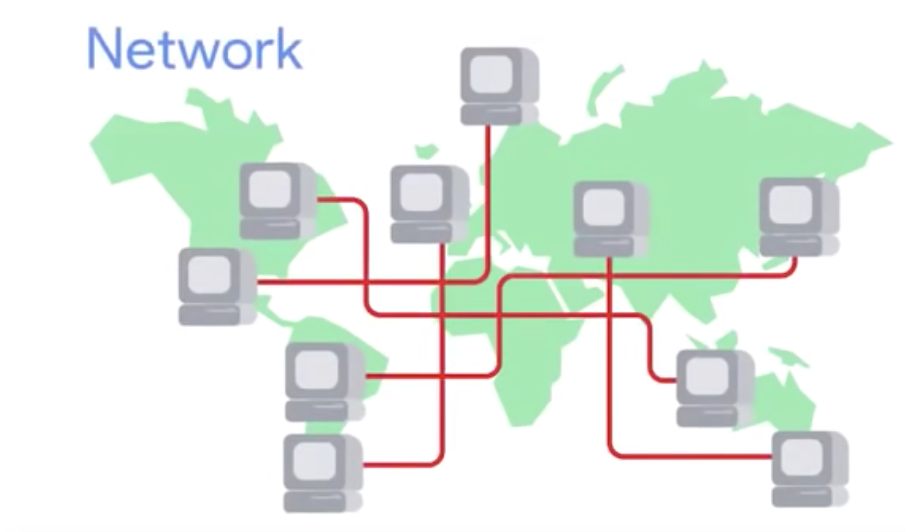
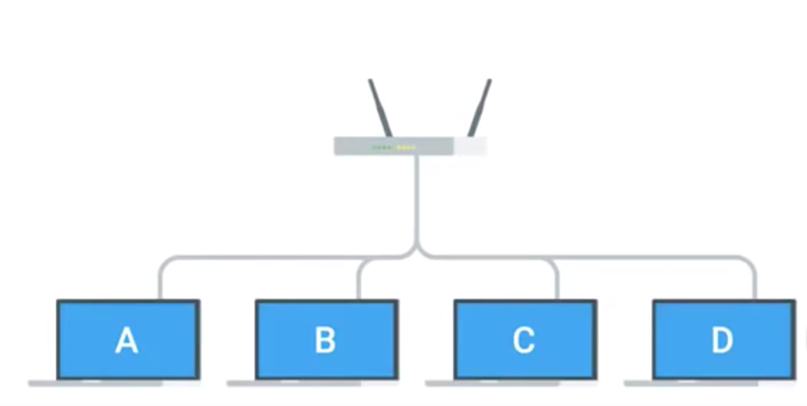

# IT Support Professional Certificate
## Technical Support Fundamentals

### Intro to IT

>Introduction

>History of Computing

>Digital Logic

>Computer Architecture Layer

### Hardware

>The Modern Computer

>Components

>Starting It Up

### Operating System

>What is an operating system?

>Installing an Operating System

### Networking

>What is networking?

>Limitation of the Internet

>Impact of the Internet

### Software

>Intro to Software

>Interacting with Software

### Troubleshooting

>Troubleshooting Best Practices

>Customer Service

>Documentation

## Analysis the main points:Networking

  The Internet is the physical connection of computers and wires around the world.The web is the information on the internet.Computers on a network have an identifier called an IP address.When you send or receive data through a network you need to have both an IP and a MAC address.Router connects lots of different devices together and helps route network traffic.

### Video address:

https://www.bilibili.com/video/BV1kJ411N7pw?from=search&seid=16208136745609660425
